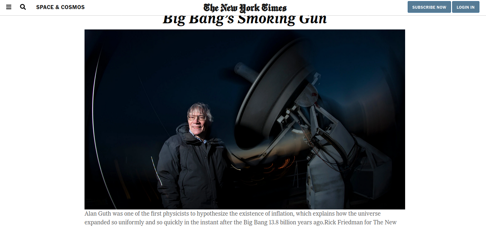

# NewYorkTimes_Clone

>Positiong and Floating elements - NewYorkTimes clone

  This project consist of positioning and floating images and text on the front page of a news paper.

  

## Built With

- Html
- CSS

## Live Demo

[Live Demo Link](https://raw.githack.com/chindrop/NewYorkTimes_Clone/feature-1/index.html)

## Authors

👤 **Author1**

- Github: [@chindrop](https://github.com/chindrop)
- Twitter: [@chin_lee5](https://twitter.com/chin_lee5)
- Linkedin: [Caleb Apronti](https://www.linkedin.com/in/caleb-apronti-8b511687/)

👤 **Author2**

- Github: [@Nellencr](https://github.com/nellencr)
- Linkedin: [Nela Komane](https://www.linkedin.com/in/nela-komane-8866b9192/)

## 🤝 Contributing

Contributions, issues and feature requests are welcome! Start by:
* Forking the project
* Cloning the project to your local machine
* `cd` into the project directory
* Run `git checkout -b your-branch-name`
* Make your contributions
* Push your branch up to your forked repository